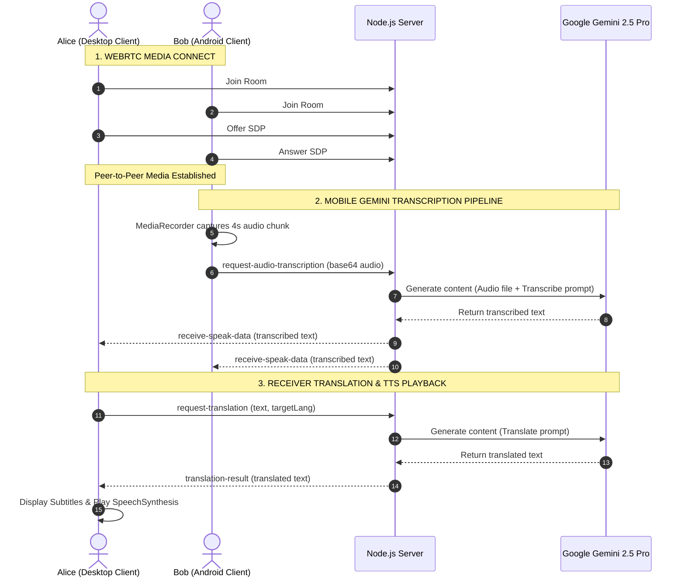

# Vingo AI - Real-Time Multilingual Meeting Platform

Vingo AI is a real-time web-based video conferencing platform designed to break language barriers in global communication. Combining WebRTC peer-to-peer media streaming with state-of-the-art Large Language Models (LLMs), Vingo AI delivers live speech-to-text transcription, translation, and text-to-speech synthesis directly during active video calls.

---

## 🎥 Key Features

- 🎥 **Real-time Video Calling** - Peer-to-peer WebRTC video and audio channels.
- 🗣️ **Multilingual Live Subtitles** - Live translation overlays for speakers of different languages.
- 🔊 **Translated Text-to-Speech** - Direct target-language voice synthesis for incoming foreign speech.
- 💬 **Live Chat & History** - Scrollable chat sidebar showing original and translated messages.
- 👥 **Adaptive Focus Layout** - Main Stage featured screen with a vertical participants sidebar (desktop) or togglable slide-up bottom drawer (mobile).
- 🖱️ **Interactive Wallpaper** - Mouse-following parallax gradients and expanding tactile ripple effects on cursor clicks.

---

## 🛠️ Technology Stack

### Backend
- **Node.js & Express:** Serves static frontend client files and handles API route management.
- **Socket.io:** Powers real-time WebRTC signaling and data event routing between peers.

### AI Engine (Large Language Model)
- **Google Gen AI Node SDK (`@google/genai`):** Backed by the **`gemini-2.5-pro`** model to perform:
  - *Audio transcription (STT):* Processing binary mobile audio chunks.
  - *Contextual translation (L2L):* High-accuracy translations between supported languages.

### Frontend
- **WebRTC (`RTCPeerConnection`):** Handles camera/microphone hardware feeds and peer stream handshakes.
- **Web Speech API (`SpeechRecognition`):** Performs local real-time speech-to-text dictation on desktop Chrome.
- **SpeechSynthesis API:** Plays back synthesized speech in the listener's target language.
- **MediaRecorder API:** Captures microphone streams in binary blocks on mobile devices.
- **CSS3 Variables & Grid/Flexbox:** Renders a modern glassmorphic theme with responsive mobile dimensions.

---

## 📐 System Architecture

Below is the operational flow diagram for Vingo AI:



---

## 🚀 Installation & Local Run

1. **Clone the repository:**
   ```bash
   git clone https://github.com/Devansh810204/Vingo-ai.git
   cd Vingo-ai
   ```

2. **Install dependencies:**
   ```bash
   npm install
   ```

3. **Configure Environment Variables:**
   Create a `.env` file in the root directory and add your Google Gemini API Key:
   ```env
   GEMINI_API_KEY=your_gemini_api_key_here
   PORT=3000
   ```

4. **Start the server:**
   ```bash
   npm start
   ```
   Or run in development mode with hot-reloading:
   ```bash
   npm run dev
   ```

5. **Access the application:**
   Open your browser and navigate to:
   - Local: `http://localhost:3000`
   - Network (for other devices): `http://<YOUR_LOCAL_IP>:3000`
   *(Note: HTTPS is required for microphone/camera permissions when testing across separate network devices.)*

---

## 📱 Mobile Compatibility & Hardware Conflict Solutions

To bypass mobile browser limits where WebRTC microphone capture locks out client-side Web Speech SpeechRecognition, Vingo AI leverages:
- **Audio Recorders:** Capturing raw local audio slices (4 seconds) via `MediaRecorder`.
- **Backend Speech-to-Text:** Submitting the raw audio data to the backend for transcription through the multimodal `gemini-2.5-pro` API.
- **Feedback Loop Protection:** Filtering out incoming speak-data matching the sender's client socket ID to block self-earpiece feedback.
- **Mobile Responsive Controls:** Automatically resizing layouts and hiding button text labels on screens `<= 480px` to fit controls on a single row.
