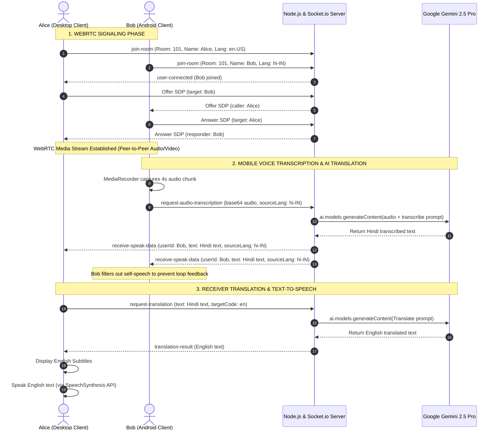

# Technical Report: Vingo AI - Real-Time Multilingual Video Conferencing System

---

## 1. Executive Summary
**Vingo AI** is a real-time web-based video conferencing platform designed to break language barriers in global communication. Combining WebRTC peer-to-peer media streaming with state-of-the-art Large Language Models (LLMs), Vingo AI delivers live speech-to-text transcription, translation, and text-to-speech synthesis directly during active video calls. The platform features a highly adaptive UI modeled after professional meeting software, an interactive mouse-reactive lighting background, and custom processing pipelines optimized to resolve hardware device constraints on mobile browsers (Android and iOS).

---

## 2. System Architecture

Below is the high-level operational sequence and architectural flow of Vingo AI, showcasing signaling, media transmission, and the Gemini AI translation loop:



---

## 3. Technology Stack

### 3.1 Backend Layer
*   **Node.js Runtime:** Serves as the primary event-driven backend environment.
*   **Express Framework:** Hosts static assets for the single-page frontend application.
*   **Socket.io:** Powers full-duplex communication channels:
    *   *Signaling Server:* Facilitates WebRTC session negotiation (SDP Offers, Answers, and ICE candidates).
    *   *Data Pipeline:* Distributes transcribed audio, text events, and room states.
*   **Dotenv:** Isolates environment variables and API keys.

### 3.2 Artificial Intelligence & LLM Layer
*   **Google Gen AI Node SDK (`@google/genai`):** Used to call the Gemini API on the backend.
*   **Model Core (`gemini-2.5-pro`):** Used for two major functions:
    *   *Speech-to-Text (STT):* Transcribes mobile base64 WebM/MP4 audio payloads in real-time.
    *   *Language-to-Language Translation (L2L):* Converts transcribed text from source language (e.g., Hindi) to target language (e.g., English) with deep contextual accuracy.

### 3.3 Frontend Layer
*   **WebRTC (`RTCPeerConnection`):** Sets up secure, peer-to-peer real-time video and audio media streams.
*   **Web Speech API (`SpeechRecognition`):** Performs local real-time speech-to-text dictation on desktop Chrome.
*   **SpeechSynthesis API:** Speaks the translated text using native target-language voice engines.
*   **MediaRecorder API:** Captures and slices local microphone tracks on mobile devices.
*   **CSS3 Custom Variables & Flexbox/Grid:** Styles the responsive, fluid meeting room interface.
*   **Particles.js:** Renders a interactive particle background.

---

## 4. Key Engineering Innovations

### 4.1 Gemini Mobile Audio Transcription Pipeline
*   **The Mobile Mic Lockout Challenge:** On Android and iOS browsers, WebRTC media streams lock the device microphone hardware. Consequently, the browser's native `webkitSpeechRecognition` cannot start or receive audio inputs, rendering client-side speech recognition inoperable.
*   **The Solution:** Vingo AI bypasses the client-side Web Speech API on mobile devices. When unmuted, the client records audio tracks directly from the active `MediaStream` using the `MediaRecorder` API. 
*   **Segmented Streaming:** The audio is sliced into short 4-second chunks, encoded into Base64 format, and pushed to the backend. The backend submits the raw binary data directly to `gemini-2.5-pro` using its native multimodal audio processing, transcribing and translating the text in one step.
*   **Feedback Control:** A custom filter `data.userId === socket.id` is checked on the frontend to ensure that when a speaker receives their own transcribed text, it is displayed as subtitles locally but does not trigger the text-to-speech engine (preventing echoing and audio loops).

### 4.2 Professional Responsive Viewport Layout (Main Stage Grid)
*   **Adaptive Layouts:** Instead of resizing video cells in a standard wrapping grid, Vingo AI introduces a professional "Focus Viewport" system:
    *   **Desktop:** The page splits into a dominant central **Main Stage** (`#main-stage`) taking up the majority of the screen space, and a **Participants List** (`#participants-container`) formatted as a vertical sidebar.
    *   **Mobile (Android/Tablets):** The focused speaker occupies the full screen, while secondary participants are tucked into an animated bottom sheet drawer to maximize viewport efficiency. A navigation bar button `Guests (x)` slides the drawer in and out.
    *   **Click-to-Focus Swap:** Clicking any card swaps it onto the Main Stage. Elements are moved in the DOM tree, and WebRTC video playback states are automatically recycled with inline `video.play()` calls to prevent stream freezing.
    *   **Dynamic Collapse:** When a user is alone in a meeting room, the sidebar/drawer and guests button hide automatically, letting the local video occupy 100% of the screen.

### 4.3 Interactive "Live Wallpaper" Background
*   **Coordinate Parallax:** A global `mousemove` event tracks cursor offsets from the center of the window and translates three blurred, colored radial background orbs in opposite directions, creating a smooth 3D depth perception.
*   **Mouse Click Ripple Spawns:** A click listener intercepts document clicks (filtering out user interface controls). On click, it dynamically appends a `.bg-ripple` element. CSS keyframe animations scale-expand the ripple from `0px` to `350px` while transitioning color from cyan to violet and fading out in `0.8` seconds, after which JavaScript garbage-collects the node.

---

## 5. Implementation Details (Code Structure)

### 5.1 Project Directory Structure
```
vingo-ai/
├── public/
│   ├── index.html       # Markup, including main stage, drawers, and controls
│   ├── style.css        # Layouts, mobile controls query, orbs and click ripples
│   └── script.js        # WebRTC connections, mobile recorder, VAD, and layout swaps
├── server.js            # Node backend, Socket signaling, and Gemini API calls
├── package.json         # Dependency configuration
└── .env                 # API Key configuration
```

### 5.2 Supported Languages
*   English (en-US)
*   Hindi (hi-IN)
*   Spanish (es-ES)
*   French (fr-FR)
*   Japanese (ja-JP)
*   German (de-DE)
